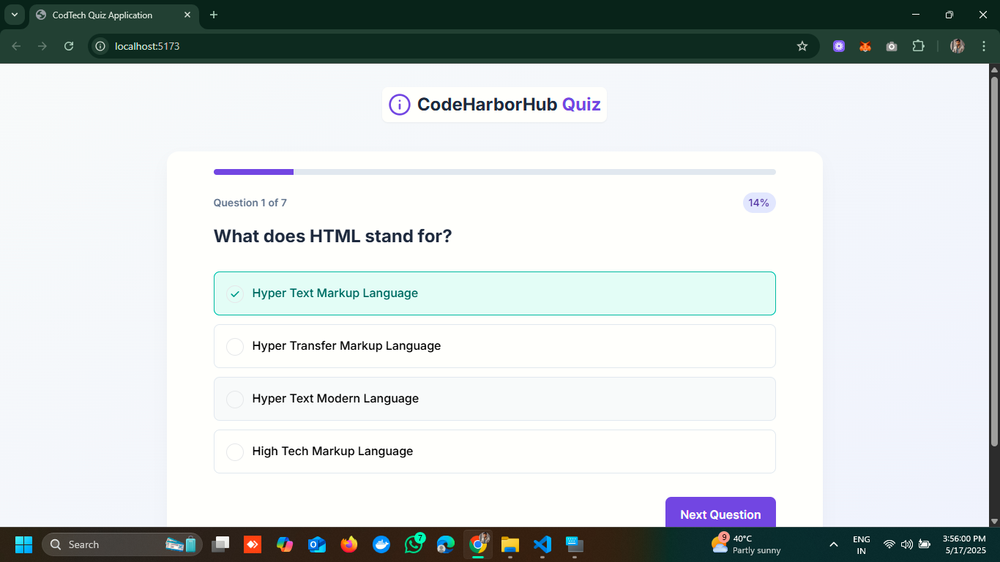
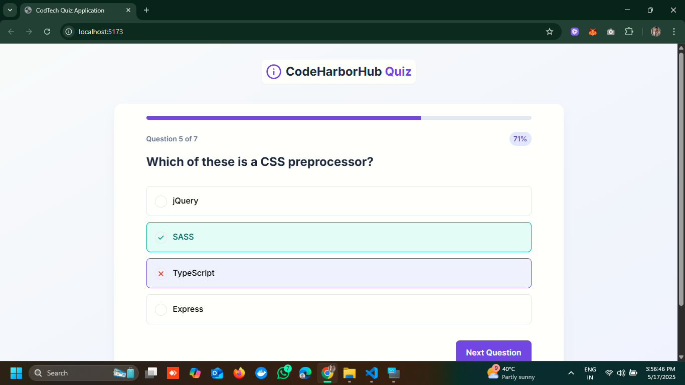
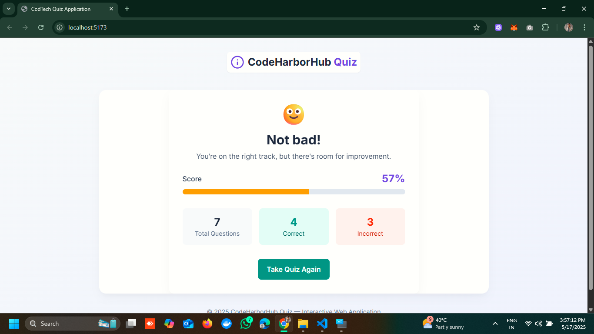

# CodeHarborHub Quiz App

## Overview

This is a simple quiz app built with React and TypeScript. It allows users to take quizzes, view their scores, and manage their quiz history.

## Features

- Quiz creation and management
- Real-time quiz taking
- Score tracking

## Demo

## Technologies Used

- React
- TypeScript
- Tailwind CSS
- Hooks

